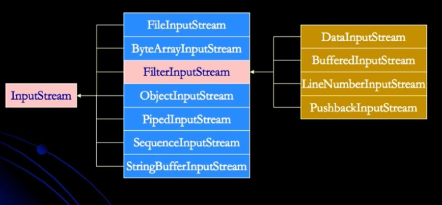
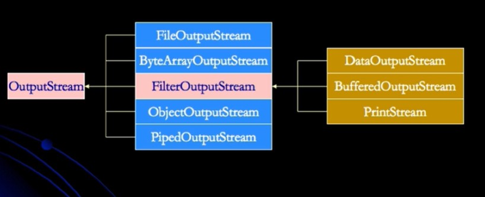
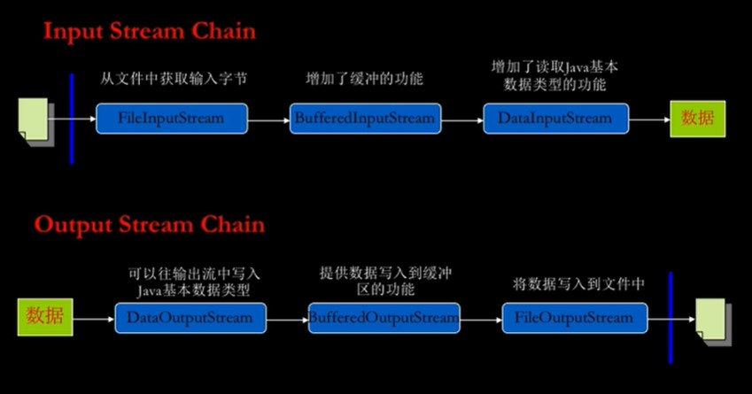
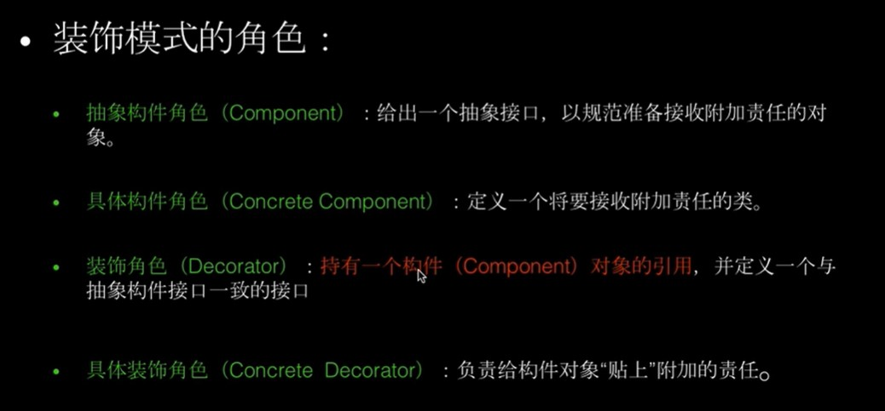
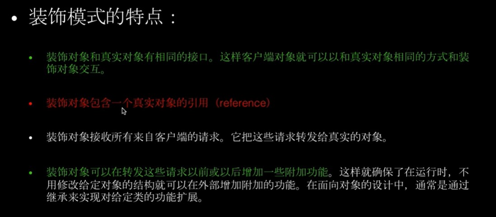

 ### BIO
 *  字节流：
 *  1. InputStream
 *  2. OutputStream
 *  字符流：
 *  1. Reader
 *  2. Writer
 *
 *  读取数据的逻辑：输入流
 *  1. open a stream
 *  2. while more information
 *  3. read information
 *  4. close the stream
 *
 *  写出数据的逻辑：输出流
 *  1. open a stream
 *  2. while more information
 *  3. write information
 *  4. close the stream
 #### 输入流
 
 
 #### 输出流
 
 
 #### 流的链接
 
 
 #### 流中使用的设计模式
 1. Decorator装饰模式
    - 装饰模式又名包装模式（Wrapper）
    - 装饰模式以对客户端透明的方式扩展对象的功能，是继承关系的一个替代方案
    - 装饰模式以对客户端透明的方式动态的给一个对象附加更多的责任
    - 装饰模式可以在不创造更多子类的情况下，将对象的功能加以扩展
    - 装饰模式把客户端的调用委派到被装饰类，装饰模式的关键在于这种扩展完全是透明的
    - 装饰模式是在不必改变原类文件和使用继承的情况下，动态的扩展一个对象的功能，它是通过创建一个包装对象，也就是装饰来包裹真实的对象
    
    
2. demo
````java
// 接口
public interface Component{
    void doSomething();
}
// 装饰类
public class Decorator implements Component{
    private Parent parent;
    public Child(Parent parent){
        this.parent = parent;
    }
    @Override
    public void doSomething(){
        parent.doSomething();
        this.other();
    }   
}
// 具体实现
public class HelloDecorator extends Decorator{
    public HelloDecorator(Component component){
        super(component);
    }
    @Override
    public void doSomething(){
        parent.doSomething();
        this.other();
    }   
    private void other(){
        System.out.println("hello");
    }
}
````
 
 
 
 ### NIO
 1. java.io与java.nio对比
    - java.io中最为核心的一个概念是流（Stream），面向流的编程，Java中，一个流要么是输入流，要么是输出流，不可能同时具备输入和输出流
    - java.nio中拥有三个核概念： Selector，Channel与Buffer。在java.nio中，我们是面向块（block）或缓冲区（buffer）编程的，Buffer本身就是一块内容，底层
       实现上，它实际上是个数组，数据的读写都是通过Buffer来实现的
    - java.nio中通过flip()方法进行读写切换
    - Buffer还提供了对于数据的结构化访问方式，并且可以追溯到系统的读写过程
    - Java中提供了Boolean类型外其他7种基本类型对应的Buffer类型，如：IntBuffer,ByteBuffer,LongBuffer等
    - 所有数据的读写都是通过Buffer进行的
    - Stream是单向的，Channel是双向的
    
    
2. NIO的三大核心
    - Selector
    - Channel
    - Buffer

3. Buffer中的重要属性
    - capacity  ：容量
    - limit     ：不能再读或写的index
    - position  ：下一个读或写的index
    
        
    
    
 ### Netty
 
 
 
 
 
 